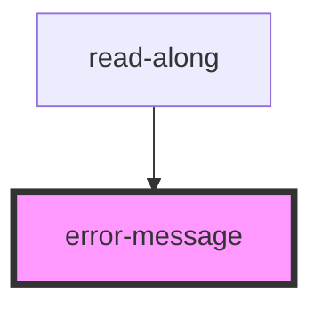

# error-message

<!-- Auto Generated Below -->

## Properties

| Property  | Attribute | Description                                                                                                       | Type     | Default     |
| --------- | --------- | ----------------------------------------------------------------------------------------------------------------- | -------- | ----------- |
| `data_cy` | `data_cy` | Cypress data-test-id value.                                                                                       | `string` | `undefined` |
| `msg`     | `msg`     | The message to display to the user.                                                                               | `string` | `undefined` |
| `timeout` | `timeout` | The on-screen duration of the error message. Zero disables this functionality, the message remains on the screen. | `number` | `0`         |

## Events

| Event     | Description                               | Type               |
| --------- | ----------------------------------------- | ------------------ |
| `expired` | Event get emitted when the timer expires. | `CustomEvent<any>` |

## Dependencies

### Used by

 - [read-along](../read-along-component)

### Graph

----------------------------------------------

*Built with [StencilJS](https://stenciljs.com/)*
