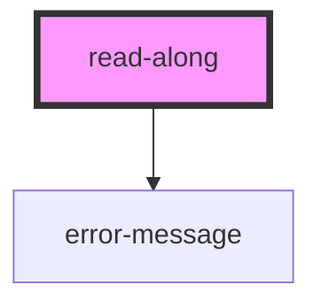

# read-along

<!-- Auto Generated Below -->

## Properties

| Property               | Attribute                   | Description                                                                                                                                                                                                                                       | Type                         | Default            |
| ---------------------- | --------------------------- | ------------------------------------------------------------------------------------------------------------------------------------------------------------------------------------------------------------------------------------------------- | ---------------------------- | ------------------ |
| `audio`                | `audio`                     | URL of the audio file                                                                                                                                                                                                                             | `string`                     | `undefined`        |
| `autoPauseAtEndOfPage` | `auto-pause-at-end-of-page` | Auto Pause at end of every page                                                                                                                                                                                                                   | `boolean`                    | `false`            |
| `cssUrl`               | `css-url`                   | Optional custom Stylesheet to override defaults                                                                                                                                                                                                   | `string`                     | `undefined`        |
| `displayTranslation`   | `display-translation`       | Show text translation  on at load time                                                                                                                                                                                                            | `boolean`                    | `true`             |
| `href`                 | `href`                      | URL of the aligned text as readalong XML                                                                                                                                                                                                          | `string`                     | `undefined`        |
| `imageAssetsFolder`    | `image-assets-folder`       | Define a path for where the image assets are located This should be used instead of use-assets-folder. Defaults to 'assets/'. The empty string means that image paths will not have a prefix added to them. Use of the forward slash is optional. | `string`                     | `"assets/"`        |
| `language`             | `language`                  | Language  of the interface. In 639-3 code. Options are "eng" (English), "fra" (French) or "spa" (Spanish)                                                                                                                                         | `"eng" \| "fra" \| "spa"`    | `"eng"`            |
| `mode`                 | `mode`                      | Choose mode of ReadAlong - either view (default) or edit                                                                                                                                                                                          | `"EDIT" \| "VIEW"`           | `"VIEW"`           |
| `pageScrolling`        | `page-scrolling`            | Toggles the page scrolling from horizontal to vertical. Defaults to horizontal                                                                                                                                                                    | `"horizontal" \| "vertical"` | `"horizontal"`     |
| `playbackRateRange`    | `playback-rate-range`       | Control the range of the playback rate: allow speeds from 100 - playback-rate-range to 100 + playback-rate-range.                                                                                                                                 | `number`                     | `15`               |
| `scrollBehaviour`      | `scroll-behaviour`          | Select whether scrolling between pages should be "smooth" (default nicely animated, good for fast computers) or "auto" (choppy but much less compute intensive)                                                                                   | `"auto" \| "smooth"`         | `"smooth"`         |
| `svgOverlay`           | `svg-overlay`               | Overlay This is an SVG overlay to place over the progress bar                                                                                                                                                                                     | `string`                     | `undefined`        |
| `theme`                | `theme`                     | Theme to use: ['light', 'dark'] defaults to the user's configured theme.                                                                                                                                                                          | `string`                     | `navigatorTheme()` |
| `useAssetsFolder`      | `use-assets-folder`         | DEPRECATED Will be removed in version 2.0.0 Toggle the use of an assets folder. Defaults to undefined. Previously (<1.2.0) defaulted to 'true'. .readalong files should just contain base filenames not the full paths to the images.             | `boolean`                    | `undefined`        |

## Methods

### `addCustomFont(fontData: string) => Promise<void>`

Add custom font

#### Parameters

| Name       | Type     | Description |
| ---------- | -------- | ----------- |
| `fontData` | `string` |             |

#### Returns

Type: `Promise<void>`

### `changeTheme() => Promise<void>`

Change theme

#### Returns

Type: `Promise<void>`

### `getAlignments() => Promise<Alignment>`

Get Alignments

#### Returns

Type: `Promise<Alignment>`

### `getCurrentWord() => Promise<Subject<string>>`

Get Current Word

#### Returns

Type: `Promise<Subject<string>>`

### `getImages() => Promise<object>`

Get Images

#### Returns

Type: `Promise<object>`

### `getReadAlongElement() => Promise<Element>`

Get ReadAlong Element

#### Returns

Type: `Promise<Element>`

### `getTranslations() => Promise<object>`

Get Translations

#### Returns

Type: `Promise<object>`

### `setCss(url: any) => Promise<void>`

Update stylesheet

#### Parameters

| Name  | Type  | Description |
| ----- | ----- | ----------- |
| `url` | `any` |             |

#### Returns

Type: `Promise<void>`

### `updateSpriteAlignments(alignment: Alignment) => Promise<void>`

Update Single Sprite

#### Parameters

| Name        | Type        | Description |
| ----------- | ----------- | ----------- |
| `alignment` | `Alignment` |             |

#### Returns

Type: `Promise<void>`

## Dependencies

### Depends on

- [error-message](../error-message)

### Graph

----------------------------------------------

*Built with [StencilJS](https://stenciljs.com/)*
