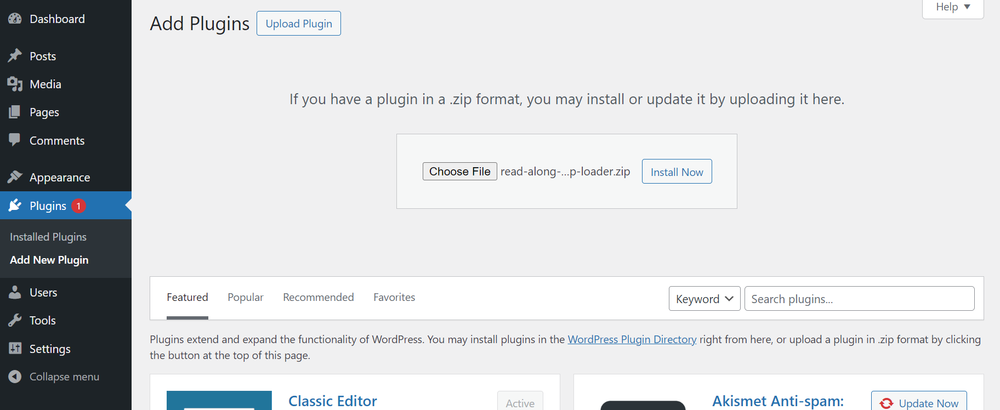
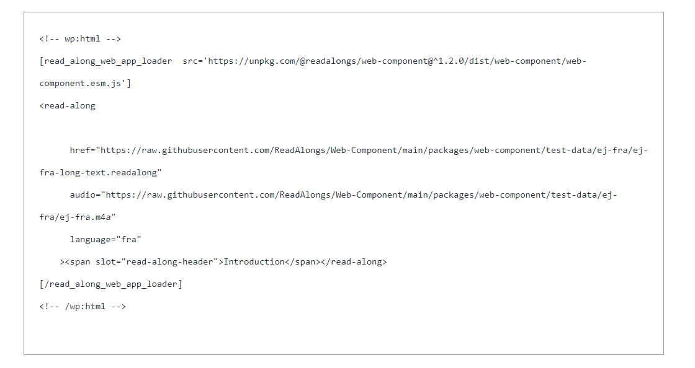
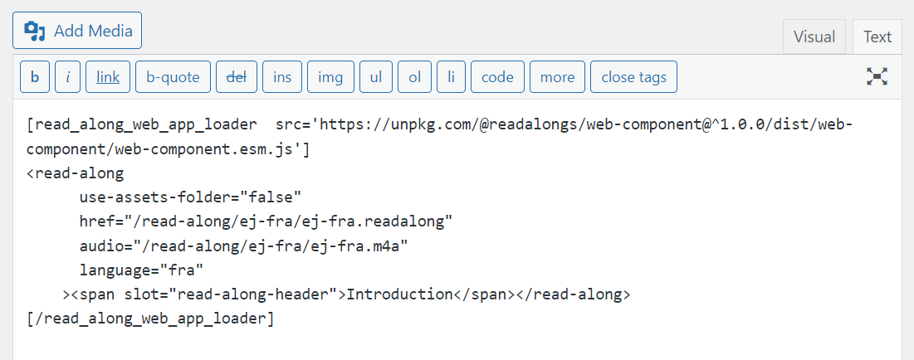

# Read Along WordPress Deployment Guide

This page contains instructions on how to embed a read-along book in your WordPress site. In this guide, the assumptions are you have:

- Basic understanding and ability to edit XML/HTML
- Generated read-along either via the **CLI** or exported a **Web Bundle** from our **Studio Web App** (https://readalong-studio.mothertongues.org/).
- Default installation of WordPress with block or classic editor
- Familiarity with HTML editing on WordPress

## Requirements

- Administrator account to your WordPress site
- (optional) Text editor ideally XML/HTML editor with syntax highlighting, e.g., VSCode, NotePad++

## Installing the Read Along Web App Loader WordPress Plugin (Do once)

You must have an administrator account on your WordPress site to install this plugin.

### Installation

1. Download the Read Along Web App Loader plugin zip file [`read-along-web-app-loader.zip`](read-along-web-app-loader.zip)
2. Login to your WordPress site
3. Choose **Plugins** from the menu of the Dashboard
4. Click **Add New Plugin**
5. Click **Upload Plugin**
6. Choose File `read-along-web-app-loader.zip` and click **Install Now**
7. Activate the plugin.

## Embedding a Read-Along in WordPress

There are several ways to deploy your read-along on your WordPress site. In this configuration, you plan to upload all your read-along assets to your site's Media Library and embed them in a page or post.

Once the Read Along Web App Loader plugin is activated on your WordPress site, you can upload your read-along alignment file `.readalong` to your media library. It is best to upload all assets to the media library on the same day since the WordPress Media Library defaults to storing media in folders by the date of upload.

1. Upload your audio, (optional) image and alignment (`.readalong`) assets to your media library.

   If the media library rejects the `.readalong` file, verify that the plugin is active and try again. If the file is still rejected, you can add `define('ALLOW_UNFILTERED_UPLOADS', true);` to `wp-config.php` in your Word Press installation. This modification has security implications and should be used temporarily only.

2. Open the `README.txt` of the read-along. In the WordPress Deployment Snippet section
   - Update the `<read-along` attribute `href=` with the `File URL` of your alignment file (`.readalong`) in your media library as needed.
   - Update the `<read-along` attribute `audio=` with the `File URL` of your audio file in your media library as needed.
   - Update the `<read-along` attribute `image-asset-folder=` with the folder path of your images as needed.
3. Copy and Paste the updated WordPress Deployment Snippet into a custom HTML block of your WordPress page/post editor, if using a classic editor the text tab of your editor
4. Preview and Publish

### Screenshots of deployed code

#### WordPress Block editor

#### Word Press Classic editor

